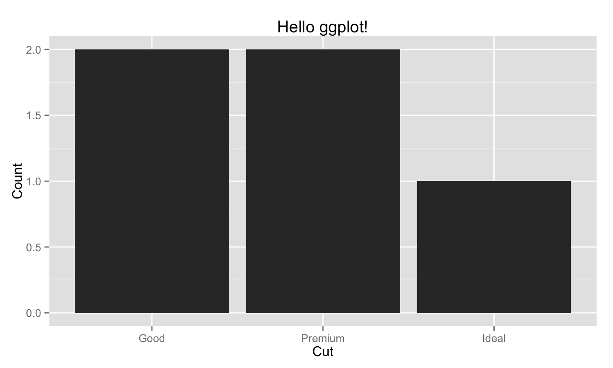
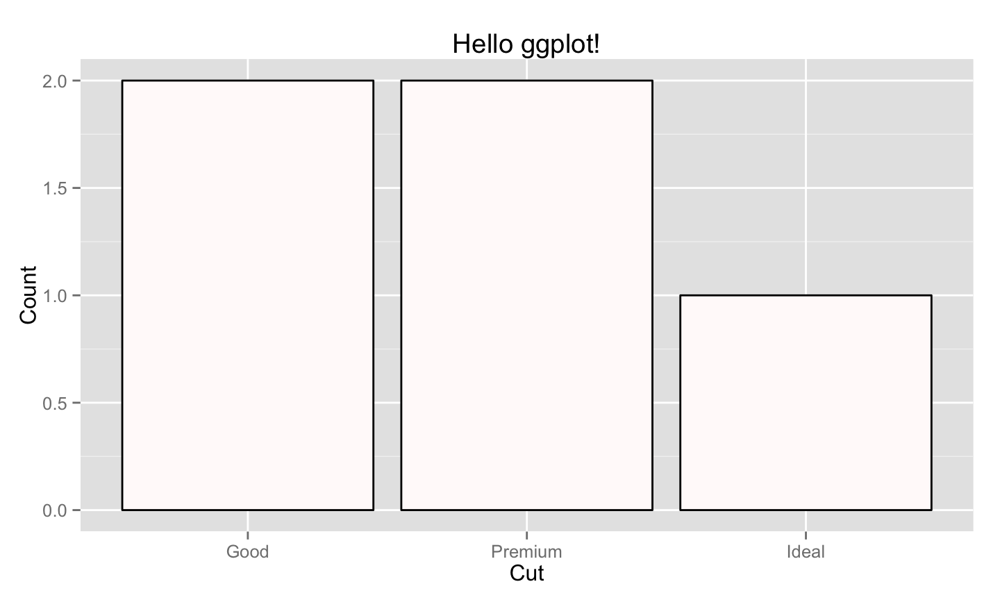
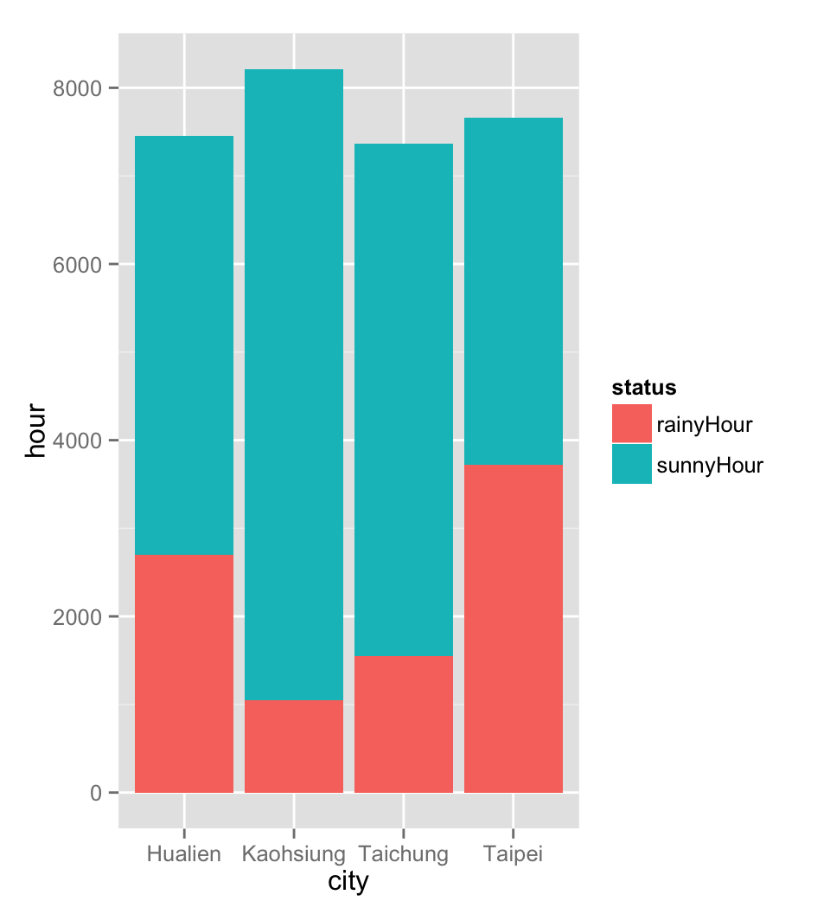

# library(ggplot2)
Kyle Chung  
July 5, 2015  


# basic syntax

## the use of main function: *ggplot*

+ `library(ggplot2)`
+ `ggplot(data, aes(x, y, group, ...)) + geom_obj(...) + modify()`
+ or a quick and dirty alternative: `qplot`
+ Usage:
    + data: an object of class `data.frame`
        + **DATA** of your plot
    + aes: a function that returns aesthetic mappings
        + **VARIABLE** in data to be plotted
    + geom_obj: geometric objects
        + **TYPE** of plot
        + `geom_bar()`, `geom_line()`, `geom_point()`, ...
    + modify: additional modification to the plot
        + `ggtitle()`, `scale_x_discrete()`, `theme_minimal()`...


## a quick example | plot distribution of diamond cut quality


```r
ggplot(data=diamonds, aes(x=cut)) + geom_bar()
```


## Factor or Numeric?
+ Variable class affects `ggplot`'s behavior
+ Variable class affects `ggplot`'s behavior. **Twice**.
+ Always check your data.frame (use `str` or `class`) before calling `ggplot`


# bar plot

## sample dataset: `diamonds`


```r
str(diamonds)
```

```
## 'data.frame':	53940 obs. of  10 variables:
##  $ carat  : num  0.23 0.21 0.23 0.29 0.31 0.24 0.24 0.26 0.22 0.23 ...
##  $ cut    : Ord.factor w/ 5 levels "Fair"<"Good"<..: 5 4 2 4 2 3 3 3 1 3 ...
##  $ color  : Ord.factor w/ 7 levels "D"<"E"<"F"<"G"<..: 2 2 2 6 7 7 6 5 2 5 ...
##  $ clarity: Ord.factor w/ 8 levels "I1"<"SI2"<"SI1"<..: 2 3 5 4 2 6 7 3 4 5 ...
##  $ depth  : num  61.5 59.8 56.9 62.4 63.3 62.8 62.3 61.9 65.1 59.4 ...
##  $ table  : num  55 61 65 58 58 57 57 55 61 61 ...
##  $ price  : int  326 326 327 334 335 336 336 337 337 338 ...
##  $ x      : num  3.95 3.89 4.05 4.2 4.34 3.94 3.95 4.07 3.87 4 ...
##  $ y      : num  3.98 3.84 4.07 4.23 4.35 3.96 3.98 4.11 3.78 4.05 ...
##  $ z      : num  2.43 2.31 2.31 2.63 2.75 2.48 2.47 2.53 2.49 2.39 ...
```

```r
head(diamonds)
```

```
##   carat       cut color clarity depth table price    x    y    z
## 1  0.23     Ideal     E     SI2  61.5    55   326 3.95 3.98 2.43
## 2  0.21   Premium     E     SI1  59.8    61   326 3.89 3.84 2.31
## 3  0.23      Good     E     VS1  56.9    65   327 4.05 4.07 2.31
## 4  0.29   Premium     I     VS2  62.4    58   334 4.20 4.23 2.63
## 5  0.31      Good     J     SI2  63.3    58   335 4.34 4.35 2.75
## 6  0.24 Very Good     J    VVS2  62.8    57   336 3.94 3.96 2.48
```


## x must be of type `factor`


```r
ggplot(data=diamonds, aes(x=cut)) + geom_bar()
```


## geom_bar drops category with no occurrence


```r
ggp <- ggplot(data=diamonds[1:5,], aes(x=cut)) + geom_bar()
ggp
```


## force display all categories


```r
ggp <- ggplot(data=diamonds[1:5,], aes(x=cut)) + geom_bar()
### <b>
ggp + scale_x_discrete(drop=FALSE) # ?scale_x_discrete
```


```r
### </b>
```


## horizontal bar


```r
ggplot(data=diamonds, aes(x=cut)) + geom_bar() + coord_flip()
```


## change label naming


```r
ggp <- ggp + xlab("Cut") + ylab("Count") + ggtitle("Hello ggplot!")
ggp
```




## change color


```r
# want to customize colors? refer to: www.cookbook-r.com/Graphs/Colors_(ggplot2)/
ggp + geom_bar(fill="snow", color="black") # see colors() if you're picky
```




## plot counts as is | when counts are pre-calculated


```r
diamonds_precounted <- as.data.frame(table(diamonds$cut, dnn=c("Cut")))
diamonds_precounted
```

```
##         Cut  Freq
## 1      Fair  1610
## 2      Good  4906
## 3 Very Good 12082
## 4   Premium 13791
## 5     Ideal 21551
```
+ take a guess before you try!
+ `ggplot(data=diamonds_precounted, aes(x=Cut)) + geom_bar() # epic FAIL`


## | wrong!


```r
ggplot(data=diamonds_precounted, aes(x=Cut)) + geom_bar()
```


## | correct!


```r
ggplot(diamonds_precounted, aes(x=Cut, y=Freq)) + geom_bar(stat="identity") # default is "bin"
```


## when using `stat="identity"`

+ row should be unique
    + otherwise counts will be summed up
+ missing label will be present at default
    + differ from `stat="bin"`
+ negative bar is allowed

```r
diamonds[1:5,]
```

```
##   carat     cut color clarity depth table price    x    y    z
## 1  0.23   Ideal     E     SI2  61.5    55   326 3.95 3.98 2.43
## 2  0.21 Premium     E     SI1  59.8    61   326 3.89 3.84 2.31
## 3  0.23    Good     E     VS1  56.9    65   327 4.05 4.07 2.31
## 4  0.29 Premium     I     VS2  62.4    58   334 4.20 4.23 2.63
## 5  0.31    Good     J     SI2  63.3    58   335 4.34 4.35 2.75
```


## 


```r
ggplot(diamonds[1:5,], aes(x=cut, y=depth)) + geom_bar(stat="identity")
```


## reorder x


```r
ggplot(diamonds_precounted, aes(x=reorder(Cut, -Freq), y=Freq)) + 
  geom_bar(stat='identity') # The order is determined by factor levels
```


## stack grouping | by `fill`


```r
ggplot(data=diamonds, aes(x=color, fill=cut)) + geom_bar()
```


## stack grouping |  by `color`


```r
ggplot(data=diamonds, aes(x=color, color=cut)) + geom_bar()
```


## dodge grouping


```r
ggplot(data=diamonds, aes(x=color, fill=cut)) + geom_bar(position="dodge")
```


## from bar to histogram | when x is numeric


```r
ggplot(data=diamonds, aes(x=price)) + geom_bar()
```


## histogram grouping | stack


```r
ggplot(data=diamonds, aes(x=price, fill=cut)) + geom_bar(position="stack")
```


## histogram grouping | identity (overlapping)


```r
ggplot(data=diamonds, aes(x=price, fill=cut)) + geom_bar(position="identity", alpha=.5)
```


## from histogram to density plot


```r
ggplot(data=diamonds, aes(x=price, fill=cut)) + geom_density(position="identity", alpha=.5)
```


## both histogram and density (scale wrong...)


```r
ggplot(data=diamonds[diamonds$cut %in% c("Fair", "Ideal"),], aes(x=price, fill=cut)) + 
    geom_density(position="identity", alpha=.5) + 
    geom_bar(position="identity", alpha=.5)
```


## both histogram and density


```r
ggplot(data=diamonds[diamonds$cut %in% c("Fair", "Ideal"),], aes(x=price, y=..density.., fill=cut)) + 
    geom_density(position="identity", alpha=.5) + 
    geom_bar(position="identity", alpha=.5)
```


## exercise!

+ use the weather data to plot:
    + total rainy hours for each city (PrecpHour)
    + total rainy volume for each city (Precp)
    + total sunny hours for each city (SunShine)
    + total hours grouped by rainy / sunny for each city
+ remember to check variable type in advanced
+ the forth plot is rather difficult


## exercise! | total rainy hours by city

 


## exercise! | total rainy volume by city

 


## exercise! | total sunny hours by city

 


## exercise! | hours group by rainy/suny by city

 


## exercise: possible solution 1 (basic)


```r
librart(ggplot2)
src_path <- "./data"
citynames <- unique(gsub("_.*", '', dir(src_path)))
citynames <- citynames[1:4] # take english version only
dat <- list()
for ( city in citynames ) {
    dat[[city]] <- do.call(rbind, lapply(grep(city, dir(src_path, full.names=TRUE), value=TRUE), 
                                         read.csv, stringsAsFactors=FALSE))
    dat[[city]]$city <- city
}
dat <- do.call(rbind, dat)
dat[dat$Precp == 'T', "Precp"] <- '0'
dat$Precp <- as.numeric(dat$Precp)

ggplot(dat, aes(x=city, y=PrecpHour)) + geom_bar(stat="identity")
ggplot(dat, aes(x=city, y=Precp)) + geom_bar(stat="identity")
ggplot(dat, aes(x=city, y=SunShine)) + geom_bar(stat="identity")

dd <- by(dat, dat$city, 
         function(x) c(rainyHour=sum(x$PrecpHour), sunnyHour=sum(x$SunShine)))
dd <- as.data.frame(do.call(rbind, dd))
dd$city <- rownames(dd)
dd <- reshape(dd, direction="long", varying=c("rainyHour", "sunnyHour"), 
              idvar="city", v.names="hour", times=c("rainyHour", "sunnyHour"), timevar="status")
ggplot(dd, aes(x=city, y=hour, fill=status)) + geom_bar(stat="identity")
```


## exercise: possible solution 2 (advanced)


```r
library(ggplot2)
library(data.table) # need 1.9.5 => devtools:install_github("Rdatatable/data.table", build_vignettes=FALSE)
src_path <- "./data"
citynames <- unique(gsub("_.*", '', dir(src_path)))
citynames <- citynames[1:4] # take english version only
dat <- list()
for ( city in citynames )
    dat[[city]] <- rbindlist(lapply(grep(city, dir(src_path, full.names=TRUE), value=TRUE), fread))
dat <- rbindlist(dat, idcol="city")
dat[Precp == 'T', Precp:='0']
dat[, Precp:=as.numeric(Precp)]

for ( var in c("PrecpHour", "Precp", "SunShine") ) 
    print(ggplot(dat, aes_string(x="city", y=var)) + geom_bar(stat="identity"))

dd <- melt(dat[, list(PrecpHour=sum(PrecpHour), SunShine=sum(SunShine)), by="city"], 
           id.vars="city", measure.vars=c("PrecpHour", "SunShine"), 
           variable.name="status", value.name="hour")
ggplot(dd, aes(x=city, y=hour, fill=status)) + geom_bar(stat="identity")
```


<div class="columns-2">
## proportional stacking bar


</div>


<div class="columns-2">
## need to transform data and then use `stat="identity"`


```
##     color       cut  cnt        pct
##  1:     E     Ideal 3903 0.39838726
##  2:     E   Premium 2337 0.23854241
##  3:     E      Good  933 0.09523323
##  4:     I   Premium 1428 0.26337145
##  5:     J      Good  307 0.10933048
##  6:     J Very Good  678 0.24145299
##  7:     I Very Good 1204 0.22205828
##  8:     H Very Good 1824 0.21965318
##  9:     E      Fair  224 0.02286414
## 10:     J     Ideal  896 0.31908832
## 11:     F   Premium 2331 0.24428841
## 12:     I     Ideal 2093 0.38601992
## 13:     I      Good  522 0.09627444
## 14:     E Very Good 2400 0.24497295
## 15:     G Very Good 2299 0.20359547
## 16:     D Very Good 1513 0.22332103
## 17:     F Very Good 2164 0.22678684
## 18:     F      Good  909 0.09526305
## 19:     H      Good  702 0.08453757
## 20:     D      Good  662 0.09771218
```
</div>


## possible solution 1 | just do it: `aggregate` and `lapply`


```r
diamonds$cnt <- 0L
diamondsDF <- aggregate(data=diamonds, cnt ~ color + cut, FUN=length)
diamondsDF <- do.call(rbind, lapply(split(diamondsDF, diamondsDF$color), 
                                  function(x) within(x, pct <- cnt / sum(cnt))))
head(diamondsDF)
```

```
##      color       cut  cnt        pct
## D.1      D      Fair  163 0.02405904
## D.8      D      Good  662 0.09771218
## D.15     D Very Good 1513 0.22332103
## D.22     D   Premium 1603 0.23660517
## D.29     D     Ideal 2834 0.41830258
## E.2      E      Fair  224 0.02286414
```


## possible solution 2 | play tricky: `table` and `by`


```r
DF <- as.data.frame(table(diamonds$color, diamonds$cut, dnn=list("color", "cut")))
DF <- do.call(rbind, by(DF, DF$color, 
                        function(x) within(x, pct <- Freq / sum(Freq))))
head(DF)
```

```
##      color       cut Freq        pct
## D.1      D      Fair  163 0.02405904
## D.8      D      Good  662 0.09771218
## D.15     D Very Good 1513 0.22332103
## D.22     D   Premium 1603 0.23660517
## D.29     D     Ideal 2834 0.41830258
## E.2      E      Fair  224 0.02286414
```


## possible solution 3 | try `ave`

```r
diamonds$cnt <- ave(rep(1, nrow(diamonds)), diamonds$color, diamonds$cut, FUN=sum)
diamonds$cnt_by_color <- ave(rep(1, nrow(diamonds)), diamonds$color, FUN=sum)
diamonds <- transform(diamonds, pct=cnt / cnt_by_color)
DFave <- unique(diamonds[,c("color", "cut", "cnt", "pct")])
head(DFave)
```

```
##   color       cut  cnt        pct
## 1     E     Ideal 3903 0.39838726
## 2     E   Premium 2337 0.23854241
## 3     E      Good  933 0.09523323
## 4     I   Premium 1428 0.26337145
## 5     J      Good  307 0.10933048
## 6     J Very Good  678 0.24145299
```


## possible solution 4 | use `data.table`


```r
library(data.table)
diamondsDT <- as.data.table(diamonds)
diamondsDT <- diamondsDT[, list(cnt=.N), by="color,cut"]
diamondsDT <- diamondsDT[, pct:=cnt / sum(cnt), by="color"]
head(diamondsDT)
```

```
##    color       cut  cnt        pct
## 1:     E     Ideal 3903 0.39838726
## 2:     E   Premium 2337 0.23854241
## 3:     E      Good  933 0.09523323
## 4:     I   Premium 1428 0.26337145
## 5:     J      Good  307 0.10933048
## 6:     J Very Good  678 0.24145299
```


## possible solution 5 | use `dplyr`


```r
library(dplyr)
DP <- summarise(group_by(diamonds, color, cut), cnt=n())
DP <- mutate(DP, pct=cnt / sum(cnt))
head(DP)
```

```
## Source: local data frame [6 x 4]
## Groups: color
## 
##   color       cut  cnt        pct
## 1     D      Fair  163 0.02405904
## 2     D      Good  662 0.09771218
## 3     D Very Good 1513 0.22332103
## 4     D   Premium 1603 0.23660517
## 5     D     Ideal 2834 0.41830258
## 6     E      Fair  224 0.02286414
```


## possible solution 6 | forever SQL


```r
# options(gsubfn.engine='R') # try this line should you have trouble loading the package
library(sqldf)
tmp1 <- sqldf('select color, cut, count(*) as cnt from diamonds group by color, cut')
tmp2 <- sqldf('select color, sum(cnt) as cnt_by_color from tmp1 group by color')
DFSQL <- sqldf('select tmp1.color, cut, cnt, (cnt*1.0 / cnt_by_color) as pct 
               from tmp1 join tmp2 on tmp1.color = tmp2.color')
head(DFSQL)
```

```
##   color       cut  cnt        pct
## 1     D      Fair  163 0.02405904
## 2     D      Good  662 0.09771218
## 3     D     Ideal 2834 0.41830258
## 4     D   Premium 1603 0.23660517
## 5     D Very Good 1513 0.22332103
## 6     E      Fair  224 0.02286414
```


## finally, proportional stacking bar


<div class="columns-2">
## exercise!


</div>


## possible solution

```r
library(ggplot2)
dd2 <- do.call(rbind, by(dd, dd$city, 
                        function(x) within(x, pct <- hour / sum(hour))))
ggplot(dd2, aes(x=city, y=pct, fill=status)) + geom_bar(stat="identity")
```


